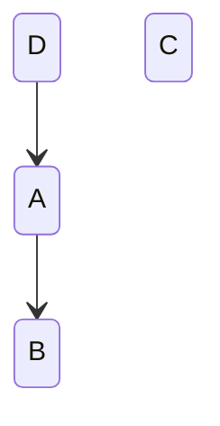
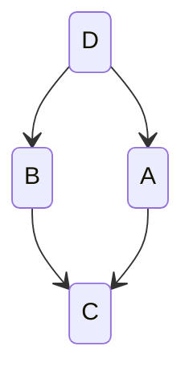
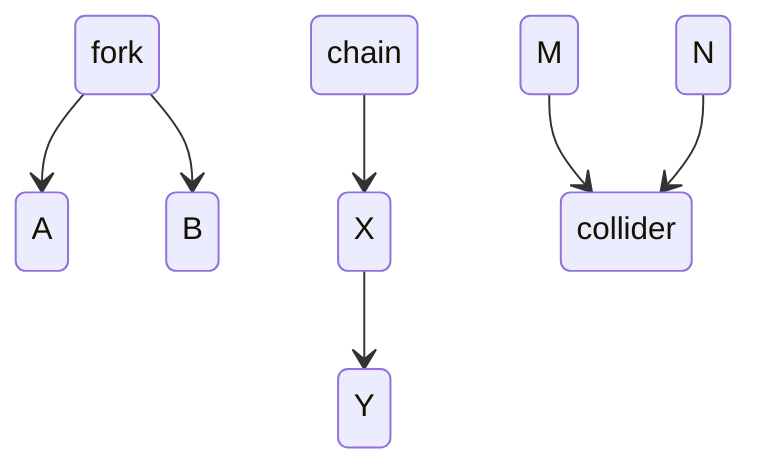
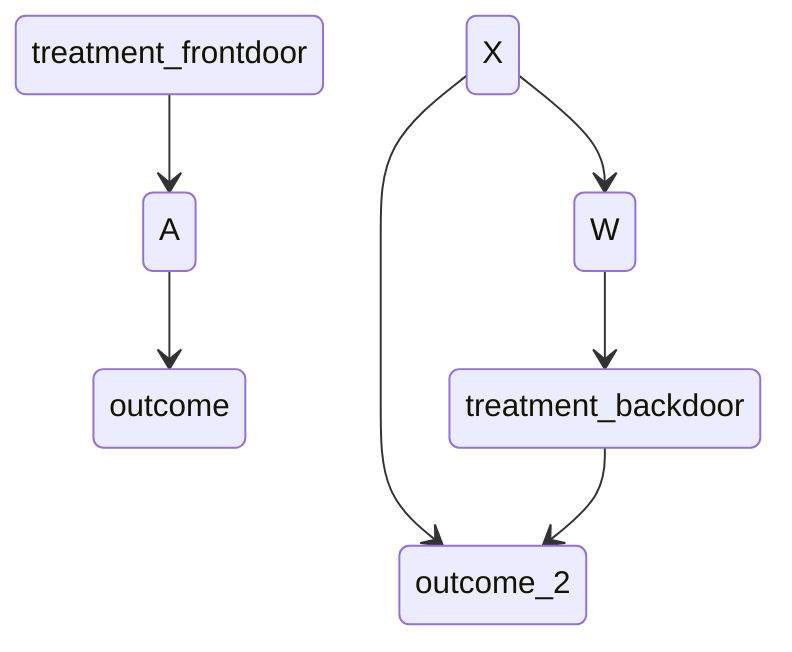
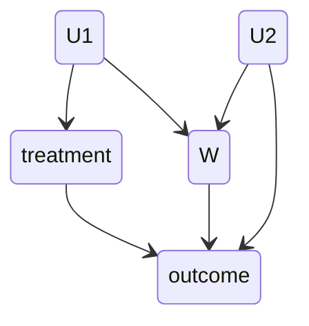
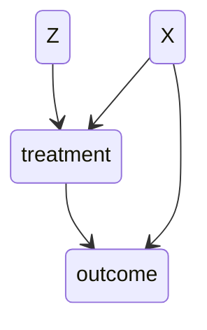

to do
 - re-read Book of Why (and skip some sections) to write down notes and “rules” for solving causal diagrams

# core concepts

## potential and observed outcomes

Causal inference involves estimating the causal effect of some treatment on an outcome.

A **potential outcome** $Y^a$ is the outcome we would see under a treatment option $a$. Usually $a$ is zero or one (got vs did not get a treatment). Before treatment all outcomes are *potential* since they did not happen yet. Afterwards, only one **observed outcome** per subject is measured and real. This is the **fundamental problem of causal inference**: you can only one observed potential outcome per subject. Eg you can only see $Y^1$ if the subject received treatment $a=1$. Casual inference is all about solving this problem.

All outcomes that would have occurred under treatments that the subject didn't observe are called **counterfactual outcomes**, eg potential outcome $Y^0$.

A treatment has a causal effect if the potential outcome under it is different from another treatment (or no treatment).

To put it succinctly, causal inference is about answering *what would have happened if we did something else*. While we cannot reverse time and answer what would've happened to a particular subject, we can estimate population level (average) causal effects.

## treatments = interventions

It is cleanest to think about the causal effects of interventions or actions - something that can be manipulated. Or another way, something that can be a part of an experiment. Holland(1986) wrote "no causation without manipulation".

**No hidden versions of treatment** is an assumption that there is only one treatment version. Otherwise, different versions could be associated with different outcomes. Eg, it is better to talk about the causal effect of a diet than on a healthy BMI, because you can get to a healthy BMI in many ways (for example, you could get sick and lose weight).

It is hard to reason about the effects of **immutable variables** like age or gender: there are effects of them, they just don't fit a causal inference framework. The notion of potential outcomes makes little sense here (what does it mean "what if I were 10  years younger?" Am I the same person I was 10 years ago? Or someone like me but younger?). Better is to talk about interventions, like changing a name on a resume from male to female.

## average causal effect

Is the difference between what if everyone got one vs the other treatment. A hypothetical effect that we try to estimate. This is not equal to the observed values unless we do an randomized experiment. This is because the subpopulation that got the treatment might be different from the whole. The equation left of the $\neq$ is a difference in means of potential outcomes, whereas the one on the right is conditional means.

$$
E(Y^1 - Y^0) \neq E(Y|A=1) - E(Y|A=0)
$$

### other causal effects

- **causal relative risk**: $E(Y^1 /  Y^0)$
- **effect of treatment on the treated**: $E(Y^1|A=1) - E(Y^0|A=1)$ (what if the treated people did not get the treatment?)
- **subpopulation with covariate**: $E(Y^1 - Y^0|V=v)$
  (if these are different from the average, then we have *heterogeneity of treatment effects*)

## causal assumptions

Identifiability of causal effects rests on untestable assumptions. Identifiability means the ability to estimate parameters from data.

### stable unit treatment value assumption (SUTVA)

Actually two assumptions:

- treatment assignment of one unit does not affect another unit
- there is only one version of treatment

These are what allow us to write about one person's potential outcome, irrespective of others.

### consistency

Potential outcome $Y^1$ is equal to the observed outcome $Y|A=1$. Ie, if we observe an outcome with a given treatment, that observed outcome is the same as the potential outcome with that same treatment. (Feels more like a definition than an assumption)

### ignorability or the "no unmeasured confounders"

$$
Y^0, Y^1 \perp\!\!\!\perp  A|X
$$

This should mean that we can *think of treatment as random*, within specific values of the confounder X (eg, people of the same age). More precisely: the potential outcome is independent of treatment given X. Another way: your outcome did not influence your assignment of treatment, within X. It's not too easy to wrap my head around this, but I think I get it.

Example: you have Covid patients and think of giving them a treatment. Older ones are more likely to get it, but we can measure age (our X) and within X the likelihood of being cured *with or without treatment* (ie, $Y^0, Y^1$) is independent of treatment assignment, when controlling for age.

It is called ignorability because "we can ignore treatment assignment once we control for confounders".

### positivity

Everyone had a chance of getting treatment.
$$
p(A = a | X = x) > 0 \;\forall\;(x, y)
$$

### from causal assumptions to causal inference: standardization

1. $E(Y | A = a, X = x)$ involves only observed data, the average outcome for a given treatment and confounder set

2. $E(Y^a | A = a, X = x)$ by consistency when $A = a$ then the observed outcome is the same as potential outcome
3. $E(Y^a | X = x)$ we can ignore treatment assignment when speaking about potential outcomes because of ignorability (ie, A is random, so the *potential* outcome is the same no matter which assignment you got - mind you, the *observed* outcome is not the same... potential is the same because of that randomness)
4. if we want the marginal causal effect, we average across all values of $X$ as shown below. Ie, this is a weighted mean across all stratums (from stratification) that are relevant

$$
E(Y^a) = \sum_x E(Y | A=a, X=x) p(x)
$$

This is the standardization approach (idk why he calls it standardization). It won't work all the time since X would usually be a collection of variables. Many of their combinations would have zero examples.

### confounders

A confounder is a variable that affects both the treatment assignment and the outcome.

We want to identify enough confounders to have the ignorability assumption hold. But knowing which ones is hard (*impossible). You can use causal graphs to help you in this.

# causal graphs

Encode assumptions about relationships between variables (or collections of variables) and help you to identify what to control for to achieve ignorabilty. They encode assumptions about dependencies (independent, dependent, conditionally dependent) and joint distributions of variables.

Directed acyclic graphs have only directed edges and have no cycles.

## example 1: getting relationships from graphs

$p(C | A, B, D) = p(C)$​ -> C is independent

$p(B | A, B, C) = p(B | A)$ -> B is only dependent on A (also $B \perp\!\!\!\perp  C, D | A$, ie B is independent of C and D given A)

$p(D | A, B, D) = p(D | A)$ -> D is only dependent on A

## example 2: getting relationships from graphs

Only one thing to mention here

$p(A| B, C, D) = p(A | D, C)$​ -> A depends on both the parent and the child (really?)

## decomposition of joint distribution

When doing decomposition start with parents, then their children, then their children's children, etc. This tells you the *joint distribution* of these variables, ie the probability to get a particular combination of values in these variables.

$p(A, B, C, D) = p(D) * p(A | D) * p(B | D) * p(C | A, B)$

Another way to write it is *p(A and B and C and D)*

The dependence of A on C is lost (see example 2) and I'm not sure why.

## from causal graphs to dependence

A vague definition: when causal effects (or "information") "flow" from one variable to another, these variables are dependent.

- in the case of the fork, A and B are dependent as the same effect flows into both
- in the case of the chain, information flows from the root, through X into Y
- a collider stops information flow. M and N are not dependent

### impact of blocking / conditioning

Conditioning roughly means "making it the same for everyone", ie going through all possibilities (ie, values) for a variable and measuring the dependencies between the other variables.

- **fork**: conditioning on the root removes the dependence between A and B
- **chain**: conditioning on X removes the dependence of Y to the root
- **collider**: conditioning on the collider makes M and N dependent ("opens up the path")

example temperature -> ice -> falling

### d-separation

A path is d-separated by a set of nodes C if blocking C creates independence between the remaining variables. This means

- with forks, C has to contain the root
- with chains, C has to contain X
- with colliders, C cannot contain the collider *or its descendants*

Two nodes A and B are d-separated by a set C if blocking it blocks every path from A to B.

- then $A \perp\!\!\!\perp  B|C$

Bringing this back to causal inference, we want to have d-separation between the treatment and the potential outcomes.

# using causal graphs to select variables to control for

## backdoor path criterion

A frontdoor path is a path from the treatment to outcome that begins with an arrow starting from the treatment. Frontdoor paths are fine, we don't need to (and shouldn't) control for anything on them. **Causal mediation analysis** involves exploring frontdoor paths.

A backdoor path is one that starts with an arrow *going into treatment*. They confound the relationship between treatment and effect. To sufficiently control for confounding we want to find a set of variables that block all backdoor paths.

In fact, the **backdoor path criterion** is this:

- the chosen set of variables Z blocks all backdoor paths from treatment to outcome
- it does not include any descendants of treatment

The set Z is not necessarily unique. In the second example above any of these satisfy the backdoor path criterion: {X}, {W}, {X and W}

Practical suggestion: when doing this by hand and if the graph is complicated, it's useful to spell out all individual paths. For the example above that would look like this:

- treatment <-- W <-- X --> outcome

## disjunctive cause criterion

Control for all observed causes of the exposure, outcome or both. You don't need to know the whole graph, just the variables that affect those two so it's useful in those cases.

But, it *doesn't work all the time*. You need to correctly identify all the observed causes of treatment or outcome. This is not completely clear to me, but here is an example below where the disjunctive cause criterion doesn't work.

$U_1$ and $U_2$ are unobserved variables. W here is a collider between $U_1$ and $U_2$. It is a cause of the outcome, so we control for it according to the disjunctive cause criterion. But doing this we open a path from the treatment through $U_1$ to the outcome. We could've identified the correct set if:

- we knew of this diagram and decided against using the disjunctive criterion (in fact, we shouldn't control for anything)
- we could observe the unobserved variables and then control for them according to the disjunctive cause criterion

# methods for controlling variables

*I did not write these down yet, but I jumped to instrumental variables*

# instrumental variables

## assumptions

**Instrumental variables** is a causal inference method alternative to controlling confounders. An instrumental variable 1) affects the treatment outcome and 2) is associated with the outcome but only through its effect on treatment (the last part is called **exclusion restriction**). This means that IVs also cannot affect the outcome through confounders, unmeasured or measured. This last fact makes IVs useful when we have unmeasured confounders.

- the exclusion restriction is key here, similar to how ignorability is key when controlling for confounders
- also as with ignorability, this assumption is untestable and relies on subject matter knowledge
- the first assumption (IV affects treatment) is testable

It *does not rely on the ignorability assumption*. (I think) They HAVE to be randomized or quasi randomized, otherwise they would have paths to the outcome. They can be randomized manually or "naturally" (eg weather). Other assumptions are necessary. For example, if the subjects are not blind, then the IV could influence them directly (eg, let's say they know they are in the placebo group). This is part of the exclusion restriction.

In the [Swanson article][Swanson article]  they mention the **exchangeabilty assumption**. "At baseline, subjects with Z = 0 are comparable to subjects with Z = 1." Some versions of this do not suppose that the instrument has a causal effect on the treatment. It can also be a surrogate for an unmeasured causal instrument. This applies to exclusion restriction as well.

## examples

Some ways of conceptualizing instrumental variables

- You can think of them as "encouragements" (eg, good weather encourages you to go for a run). Either binary or a "dose" of encouragement
- In studies with imperfect compliance, these are "what the experimenters wanted the subjects to do" (instrument) vs "what they actually did" (the treatment)
- other examples of natural randomizations:
  - time, eg something becoming more popular over time
  - geographic distance, eg distance from a specialized hospital
  - mendelian randomization, eg some genetic variant leads to greater alcohol use
  - provider preference, eg one doctor prefers some treatment (past prescriptions are the IV here)
  - quarter of birth as an IV for years in school

An example: we want to know the effect of smoking on baby birth weight. Instead of randomizing smoking (the treatment), we randomize encouragement to stop smoking (the instrument). We are interested, though, not in the effect of the encouragement (there could be different encouragements employed later). We are interested in the effect of smoking on the whole population. 

## theory

potential values and causal effects

- each subject now has potential values of treatment $A^0$ and $A^1$, depending on the value of the instrument
- there is the average causal effect of treatment *assignment* on treatment *received* $E(A^1 - A^0)$ which can be estimated from observed data because of consistency and randomization (check the causal assumptions section for more details)
  - in the case of perfect compliance this would be 1 (for binary assignment and binary treatment)
- there is also the average causal effect of treatment assignment on the outcome (or put another way, the effect of encouragement on the outcome)
  - with perfect compliance this would be the same as the causal effect of treatment
- what we want, though, is the effect of the treatment on the outcome

Depending on their potential outcomes of treatment (ie, "would the user take the treatment if they were given the encouragement"), we can divide subjects into four groups (part of the Rubin causal model):

| $treat^0$ | $treat^1$ | label         |
| --------- | --------- | ------------- |
| 0         | 0         | never-takers  |
| 0         | 1         | compliers     |
| 1         | 0         | defiers       |
| 1         | 1         | always-takers |

These are subpopulations of subjects, but they are not observable (ie, they are based on potential values). The things we observe from them are values of the instrument and treatment, and basing on these we can only narrow down the particular subject down to two categories. For example, if you were assigned the encouragement (instrument = 1) but you did not take the treatment (treatment = 0), you are either a defier or a never-taker.

We want to learn about the effect of the treatment on the outcome. The only subpopulations we can learn this about is the compliers and defiers since their treatment varies depending on the instrument. Defiers are (thought to be) rare or they cannot exist (eg, if treatment is a drug the base group would not have access to it). So we focus on the compliers.

Because of this, the instrumental variable are said to be focused on a local average treatment effect (effect on a subpopulation), not the total average effect as in when we control for confounders. The formula below describes this... this is just the *effect on compliers*.
$$
E(Y^{Z=1} | A^0 = 0, A^1 = 1) - E(Y^{Z=0} | A^0 = 0, A^1 = 1)
$$
And this formula means the same as below, since compliers take the treatment assigned to them
$$
E(Y^{A=1} | ...) - E(Y^{A=0} | ...)
$$
Another term for this is *complier average causal effect* (CACE), whereas the *local average treatment effect* (LATE) can apply to other subpopulations, not just compliers.

## monotonicity assumption

Increasing encouragement leads to an increase in the probability of treatment. Ie, there are no defiers

This allows us to assign a group to certain classes of subjects. In particular, if $instrument = 0$ and $treatment = 1$, then the subject has to be an always-taker (the defier option is not there). A similar case exists for never-takers.

This, in turn, allows us to estimate the CACE.

- we know we can identify the effect of the instrument Z: $E(Y | Z = 1) - E(Y | Z = 0)$

- this can be expressed as a weighted average of the 3 subpopulations (defiers don't exists, so only 3)

- for always takers and never takers, instrument doesn't do anything $E(Y | Z = 1, always\_takers) = E(Y | always\_takers)$

- by randomization, we expect the proportions of the 3 populations to be the same for the 3 groups (yes, IVs need to be randomized!)

- this leads to below (see video for full explanation), where the right hand side at the bottom is the CACE
  $$
  E(Y | Z = 1) - E(Y | Z = 0) = E(Y | Z = 1, compliers)*p(compliers) - E(Y | Z = 0, compliers)*p(compliers)
  \\
  \
  \\
  \frac{(E(Y | Z = 1) - E(Y | Z = 0))}{p(compliers)} = E(Y | Z = 1, compliers) - E(Y | Z = 0, compliers)
  $$
  
  
- so now we need to estimate the proportion of compliers, which is just the effect of the instrument on the treatment. Why? Because compliers are the only ones who change their behavior and defiers don't exist. Therefore CACE is equal to the effect of IV on the outcome divided by the outcome of IV on the treatment

$$
\frac{E(Y | Z = 1) - E(Y | Z = 0)}{E(A | Z = 1) - E(A | Z = 0)}
$$

Not clear how, but this should have a method for calculating confidence intervals.

## two-stage least squares

Motivation: a CACE estimation for continuous variables.

In regression, it is assumed that the error terms and the predictors are independent. If we want to regress the outcome on treatment, this is not so because of the unmeasured confounders.

The two-stage least squares method allows us to estimate the effect of treatment A using an instrument Z

1. regress treatment on instrument $\hat{A_i} = \beta_0 + \beta_1 * Z_i$
2. regress outcome on the fitted value from the first stage $Y_i = \beta_0 + \hat{A_i}\beta_1$
   *Z is independent from Y given A*

Estimate $\beta_1$ from the 2nd stage is the estimate of the **local causal effect of treatment**, ie CACE. It also gives a **confidence interval** for it.

I didn't go through the derivation because it feels it doesn't add much to the previous derivation and it is involved because of all the symbols.

There are ways to do sensitivity analysis, by relaxing the exclusion criterion (what if the instrument directly affects the outcome by an amount $x$?) and the monotonicity assumption (what if the proportion of defiers was $x$?).

## weak instruments

Strength of an instrument is its effect size on the treatment, ie how much does it increase the probability of treatment. Ie, the proportion of compliers
$$
E(A | Z = 1) - E(A | Z = 0)
$$

Weak instruments lead to **large variance of estimates** since the effective sample size is small. Many times, these instruments are unusable since their estimates are uninformative. One option is to abandon them, another is to use methods to strengthen the instrumental variables. Eg, near / far matching: match subjects so that they are similar but have very different instrument values.

# rest

*motherf -> HOW on earth do you enumerate all relevant variables (ignorability assumption) or draw the DAG?

**Decomposing probability distributions**: you can think of the individual vars as connected with AND statements

## incident user and active comparator designs

(*short*)

When the treatment lasts through time (eg, taking a medication regularly, exercising) and can be started and stopped, you can have all participants start from the same time (or, retrospectively, analyze their data from when they started). This is **incident user design**.

But when do the baseline users "start", they are not doing anything? You can replace these with another treatment so that they also have a clear start (eg, another medication). This is called an **active comparator design**. The issue with this is that it is a different causal effect than comparing treatment to no 

treatment.

## profiling compliers

(from a talk at Booking by Moritz Marbach)

How do compliers differ from non-compliers in terms of covariates. Allows to estimate the generalizability of CACE

Marbach approach:

 - assume monotonicity (no defiers) and independence (covariate is independent of the instrument)
 - when Z = 0, then everyone that takes the treatment is an alwaystaker. Ie, we can identify the average of their covariate. Same for when Z = 1, for nevertakers
 - you get the complier covariate mean by subtracting those two from the grand mean
 - provides a standard error estimate

R package: `ivdesc`

# literature

[Swanson article]: https://www.tandfonline.com/doi/pdf/10.1080/01621459.2018.1434530?needAccess=true	"Partial Identification of the Average Treatment Effect Using Instrumental Variables: Review of Methods for Binary Instruments, Treatments, and Outcomes"

causal inference papers recommended by nils about obesity
 - https://www.nature.com/articles/ijo200882
 - https://ftp.cs.ucla.edu/pub/stat_ser/r483-reprint.pdf