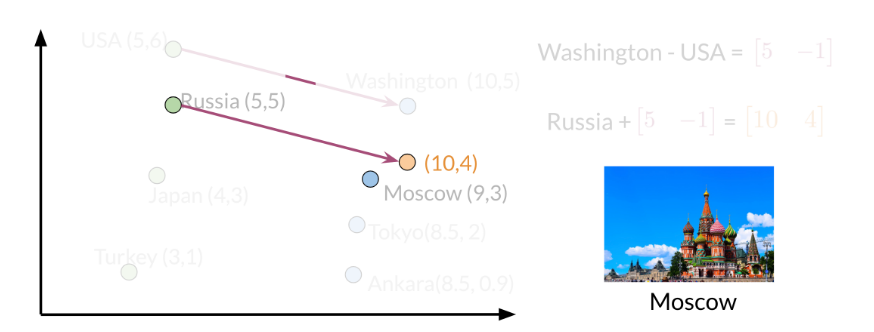

# vector space models

Represent words and documents as vectors and thus capture the meaning of words. For example, you can treat the words *age* and *old* as having a similar meaning. Or *cereal* and *bowl* as related.

Implementation: you want to count the number of times word appear next to each other

- create a matrix *N x N*, where N is the number of words in your corpus. For documents, it would be *N x M*, where N is the number of documents, and M the number of words
- pick a bandwidth / window parameter *k*
  - this is a heuristic, usually 2 or 3 for English, could be different for other languages
- count the number of occurrences $n_{ij}$ in which the $word_j$ appears within $k$ words of $word_i$ 
- for documents, count the number of times a word appears in a document
  - another option for documents (btw a sentence can be a "document") is to sum the representations of each individual word

## vector distances and algebra

You can calculate distances between these vectors

* Euclidean distance
* cosine distance (ignores absolute differences, just the angle matters)

$$
cos(90^{\circ}) = 0 \\
cos(0^{\circ}) = 1 \\
cos(\beta) = \frac{v\cdot w}{\left\lVert v\right\rVert \left\lVert w\right\rVert}
$$

* less common https://en.wikipedia.org/wiki/Wasserstein_metric

The vector representations often capture meaning of the words. You can use vector algebra to find words with a certain relationship, eg country - capital.

## using word algebra for machine translation

If you have vector representations for two languages, you can find a transformation matrix that takes you from one language to the other. It involves these steps:

1. translate from one language to another using the translation matrix $EnglishWordVector * R = FrenchWordVector'$
2. find the closest word vector in the French language corpus, ie the closest neighbor to $FrenchWordVector'$

### step1: translation matrix

This assumes the vector representations in the two languages are similar, maybe coming from the same translated corpus.

Finding the transformation matrix involves doing a training of sorts. You start with two corpuses, say in English and French. And you have a translation for a subset of these words. You initialize a random matrix that transforms English word vector representations into French ones, then try to improve on it using derivatives. The loss is calculated using the Frobenius norm, which (to me) sounds like a generalization of the L2 norm: it's the sum of squares of all matrix elements, then you take the square root of it. The norm is then squared again to make the derivative simpler.

$$
Loss = \left\| ER -F\right\| _{F}
$$

### step 2: approximate nearest neighbor

Finding the nearest neighbor can be costly to process since there are a lot of words. To speed this up you can use **locality sensitive hashing**. Hashing in general means assigning a number to a value, essentially binning them. A value will always be assigned the same number. *Locality sensitive* hashing takes into account the distances between the values (or vectors or whatever), thus binning those that are close together.

How do you do locality sensitive hashing? You divide the existing vector space into N planes (these are randomly generated planes / vectors, but not sure how you pick N). The vector P below is called the *normal vector*. It is perpendicular to the plane and has length 1. So the vector that defines the plane does not mark the boundary between the two sides of the plane. It marks the direction in which you find the 'positive' side of the plane (not intuitive). For each vector in your dataset you calculate its dot product with P. For all vectors on one side of the plane, the dot product will be positive. And negative for others.

Now you calculate these signs for all the N planes. For example, the middle area below is "minus plus plus" for the blue, yellow and purple planes respectively. These signs will give you your hash: $hash = \sum{2^i\times h_i}$, where $h_i$ is 1 if the sign is positive, and zero if it is negative.

You do not try to find the best set of planes for hashing, since (for this particular use-case) there should not be one set that slices the vector space perfectly. Instead, you repeat this process $k$ times, meaning you create $k$ sets of planes, and calculate the vectors' hash value for each of them. Then for a given vector, its approximate nearest neighbors are all vectors that fall into the same hash *for any of the $k$ planes*. Then on these approximate nearest neighbors you find an exact nearest neighbor.

Steps:

1. pick N random planes (vectors) to slice your vectors space with
2. calculate dot products between each vector in your dataset and those planes, get the sign of it
3. generate hash values using those signs
4. repeat steps 1-3 $k$ times and create the hash table
5. when you're looking for the nearest neighbor for a vector $v$, calculate the hash value for that vector, then find all vectors from the dataset that have any hash value the same (for any of the $k$!): these are your approximate nearest neighbors
6. find the nearest neighbor among these approximate neighbors

**questions**

- how do you pick the number of planes N and the $k$ number of sets of planes?

### libraries

Facebook Faiss (implementation of approximate NN) : https://github.com/facebookresearch/faiss

## using PCA

Use PCA to reduce the dimensionality of your word vectors.

## other uses beyond translation

bag of words approach to documents

- products the user clicked on / searched for

## useful matrix algebra

rotation matrix:

# tidbits

bigrams / trigrams / ngrams preserve order of words unlike unigrams (single words)

from the two simple models: Naive Bayes is generally better with less data than Logistic Regression

mispelled words

 - ignore (they show up as unique words and therefore not very useful)
 - use context to get the meaning out (tackled later)

Naive Bayes presentation: https://booking.workplace.com/events/107695886355403/?ref=newsfeed

